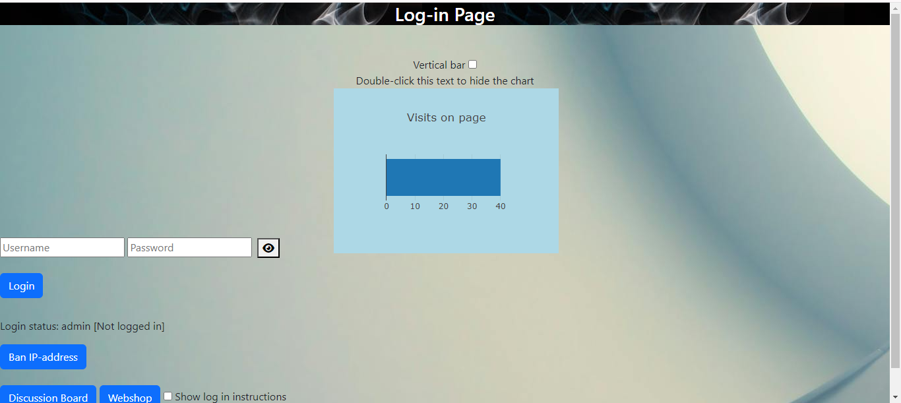
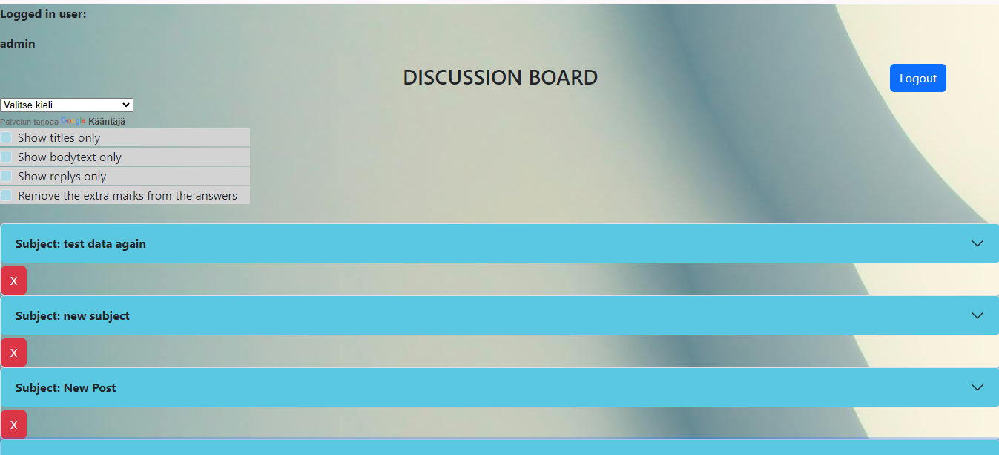

# DBoard

Project keywords: AI, Python, Django, JavaScript, JQuery, NoSQL, MongoDB, SQLite, Bootstrap 5, Font Awesome.

This Python Django and JavaScript application simulates two things. An online store that uses artificial intelligence. OpenAI GPT 3.5 chatbot is integrated into the online store, where you can ask for more information about the products.

Another thing that can be simulated is a discussion board that has similar functions to regular Internet discussion boards.

Start view

Overview of the discussion board and its user interface.

MAIN FEATURES:

CODE SPLIT 

All Python view codes are in their own .py files and are imported as modules in the original view.py file. The JavaScript code is also split into multiple .js files.

WEBSHOP

IN THE USER VIEW:

Simulates a purchase transaction in an online store. the user selects the desired products and quantity and fills in the address information. Then the entire order is stored in the database.
The selected products are stored in the localStorage in case you leave the online store and come back. Your order information can be retrieved easily with the localStorage feature later. This simulates a real-life online shopping experience. LocalStorage values ​​are retrieved using Object.values(localStorage); method

The webshop has a shopping cart made with HTML form. The user can open and close it with buttons. when the shopping cart is open, all products stored in localStorage are displayed in the organized list element of the Shopping Cart.

Each product in the Shopping Cart has a delete button, which can be pressed to remove the desired product from the shopping cart and local Storage. Buttons are created inside a for loop and each value attribute of the button gets the value of the corresponding local storage key.

Then, with the settAttribute method, an onclick event and a function that performs the deletion are set for the buttons. The delete function takes a this.value parameter, which in this case is the name of the localStorage key.

User experience is taken into account in the purchase transaction.
For example, when a product is added to the cart, the cart button gets a red border for a few seconds (Using the JavaScript setTimeout function and the style.className change) and the button also has a span element that contains a JavaScript variable that displays the number of items in the cart.

The variable is updated every time a new product is added to the shopping cart or a product is removed from the shopping cart.

The variable is also stored in localStorage, so the program remembers the number of products if the user leaves the page and returns later.
The purpose of these features is to give the user certainty that the product has been successfully added to the shopping cart.

IN THE ADMIN VIEW:

Perform CRUD operations on products. in the admin view you can also use Bootstrap's accordion/collapse features. All orders saved in the database are automatically displayed in the administrator view.
Inventory management, from the view you can quickly check which product is the most and which is the least in the database. The total amount of all products is also shown.

Attention color for the products that are most and least in stock.
the name of the product that is in short supply is shown in red and the name of the product with the most stock is shown in green.

ID CHECK in ADMIN VIEW

When the admin page is loaded, the python function also gets the values ​​from the used Id sql table. the id number of each added product is always stored in this table. When adding a new product to the id value input field, there is an onchange Hadler that checks the ids used with a javaScript function, which are imported to the html page with a Python function. If the ID given by the user already exists, the program displays a notification.

MARK DELIVERED IN ADMIN VIEW

The admin can change the delivery status by clicking the button. the order collection has a field name whose default value is no. On clicking the button, the Python function gets the subscription ID and changes the delivered status of the subscription to yes using the MongoDB update_one method.
The purpose of this feature is to facilitate the maintenance of order delivery information.

The delivered feature also uses Python and JavaScript functions to disable "delivered" buttons whose order is already marked as delivered. The supplied buttons appear as button elements that contain the Font Awesome Truck icon.

In Python code, this is done using the Django forloop.counter and forloop.last methods.
Initially, the program counts all the orders and uses the forloop.last command to get the final order count. 

Then the final amount is sent to the javascript function as a parameter and the javascript function uses a for loop to find where the entered text is yes. then set the Attribute to change the button's disbaled value to true.

REAL-TIME INVERTORY BALANCE UPDATING

Like real-world online stores, this app reduces inventory of ordered products in real-time.
When the user clicks the submit order button, the Python function receives the product ID and order quantity along with the order information. then the function decrements the value of the order collection's inventory field using the $inc method by converting the user-supplied number to a negative number and updates it using the update_one method.

CHATBOT IN ONLINE STORE

The chatbot uses the GPT 3.5 turbo API provided by OpenAI when answering questions. The code that implements the chatbot's operation is written in JavaScript. Questions are sent to the API as a dictionary object containing the API key, the API URL, and the question asked.
the answer is retrieved using JavaScript's Fetch method.

The chatbot feature is still under development, so at the moment the chatbot tells you general information about the product when you click on the question mark next to the product.

USER AUTHENTICATION:

Log-in and Log-out features. Made with Django Authenticate library.

GRAPHIC VISITOR COUNTER:

Visitor counter with Python and javascript. The Python code counts the visits and the javascript code displays the number graphically using the PlotlyJS library. Visitor counting takes place every time the homepage is reloaded. The LoginView function always updates the variable with +1 when calling the function and sends the value of the variable to the html page. then a javaScript function grabs the variable and passes it to PlotlyJS, which makes a graph of the number of visits.
The direction of the bar chart can be changed between horizontal and vertical using the check box

DISCUSSION BOARD

Simulates an online discussion board. You can post a new thread, reply to an existing message,delete the messages and like messages. Each message sent has a Mongo table in the collection where the responses are stored. This way, the topic and its answers can be clearly seen.
The conversation text can be translated into different languages. this is done using the Google Translate API. Messages are stored to the MongoDB NoSQL database.

All posts are wrapped in the Bootstrap 5 accordion/collapse element, so you can close or open posts.

TEXT FILTERING IN DISCUSSION BOARD

Bootstrap 5's html checkboxes allow you to choose whether to display only the message title, body, or message replies This works with Python and JavaScript functions. 
Checkboxes have an onclick method, which calls a JavaScript function that receives information about the option selected by the user as a parameter.

The Python function retrieves the user's selection using the request.post.getlist method and makes a new database query with the selected option. The search results are displayed in the html table element.

In the show reply message option, extra characters are automatically cleaned up by a JavaScript function that includes a replace method. The function is called in the body tag of the html page with the load event.
the extra characters are because the response messages are stored in a MongoDB array, they show the extra characters when you fetch the results to see them.

MESSAGE STATISTICS

See the number of deleted and posted messages, as well as the date of the last deletion and the date of the most recent message. The number of sent and deleted messages is also shown in the bar graphs.
values ​​are stored in own Mongo collections from which they are retrieved with Python code.

TEXT CENSORSHIP ON THE DISCUSSION BOARD

You can hide forum texts with administrator credentials. The JavaScript function runs automatically and checks if an administrator is logged in. if so, the jQuery function becomes available. With the jquery function, you can hide the texts by double-clicking

IP-ADDRESS BLOCKING

save the IP address you want to block in the database. Initially, the Python function determines the user's IP address using a websocket. Then the function checks if the address is in the database. If the address is found, the javaScript function blocks the login option.

The banned ip addresses are displayed in the table element and the user can show and hide the table using Jquery show/hide methods. The page also has a JavaScript function that automatically counts how many days each IP address in the list has been blocked. The page also has a JavaScript function that automatically counts how many days each IP address in the list has been blocked. this is made with JS date objects and getTime methods.

When you enter an IP address to block, you can add dots automatically using the Jquery Mask plugin.
The feature is for addresses in the format 000.000.00.00 and 000.00.00.000, which are two common formats for IP addresses.

The feature can be activated by selecting the desired format from the drop-down menu. 
the menu uses the onchange and this methods, which call a standard JavaScript function that receives the selected format as a parameter. The function contains the Jquery mask plugin and the definition of the input field where the property is used.

